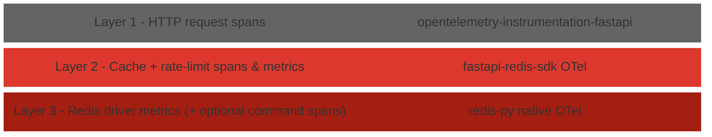

# Observability

fastapi-redis-sdk supports [OpenTelemetry](https://opentelemetry.io/) for
tracing and metrics.  Instrumentation is split into three independent layers so
each can be enabled on its own, and the library's own layer never wraps or
replaces the FastAPI or redis-py instrumentation - it only slots between them.



Each layer can be enabled independently.  A single request produces one trace
whose spans nest by layer - the FastAPI HTTP span (Layer 1) with the
fastapi-redis-sdk operation spans beneath it (Layer 2):

```
HTTP GET /products/42            ← Layer 1
 └── cache.get (HIT)             ← Layer 2

HTTP GET /limited                ← Layer 1
 └── ratelimit.hit               ← Layer 2  (ratelimit.backend=increx)
```

Layer 3 (redis-py native) contributes **metrics** by default rather than
per-command spans - see [Layer 3](#layer-3-redis-driver) below.

!!! tip "Try it locally"
    A one-command, self-contained showcase lives in
    [`examples/observability/`](https://github.com/redis/fastapi-redis-sdk/tree/main/examples/observability):
    `docker compose up --build` starts the demo app, Redis, and an all-in-one
    Grafana + Tempo + Prometheus stack, so you can see these traces and metrics
    end to end in a UI.

---

## Layer 1 - HTTP requests

Handled by the standard
[FastAPI OTel instrumentation](https://opentelemetry-python-contrib.readthedocs.io/en/latest/instrumentation/fastapi/fastapi.html).
Install `opentelemetry-instrumentation-fastapi` and call
`FastAPIInstrumentor.instrument_app(app)`.

---

## Layer 2 - fastapi-redis-sdk operations

This is what fastapi-redis-sdk adds: spans and metrics for both **caching** and
**rate limiting**.  Enable it once with the builder or an environment variable -
the single toggle covers both features:

```python
FastAPIRedis(app).lifespan().caching().rate_limiting().otel()   # builder
```

```bash
export REDIS_OTEL_ENABLED=true                                  # env var
```

Requires `pip install fastapi-redis-sdk[otel]`.

Spans are named following the
[OTel span naming guidelines](https://opentelemetry.io/docs/specs/semconv/general/how-to-define-semantic-conventions/#naming-pattern)
(`{action} {target}` pattern, low cardinality, human-readable).
Note: there is no official OTel semantic convention for caching or rate limiting
yet - cache span/metric naming is
[under discussion](https://github.com/open-telemetry/semantic-conventions/issues/1747).
Our names may change to align once a convention is adopted.

### Caching

**Spans** - one per cache operation:

| Span              | Source                                                                                           |
|-------------------|--------------------------------------------------------------------------------------------------|
| `cache.get`       | `cache()` dependency (attributes: `cache.hit`, `cache.key`, `cache.eviction_group`, `cache.ttl`) |
| `cache.set`       | Capture middleware after a cache miss                                                            |
| `cache.evict`     | `cache_evict()` dependency                                                                       |
| `cache.put`       | `cache_put()` dependency                                                                         |
| `cache.backend.*` | `CacheBackend` methods (`get`, `set`, `delete`, `delete_group`, `has`)                           |

**Metrics:**

| Metric                          | Type      | Labels                                                   | Description                   |
|---------------------------------|-----------|----------------------------------------------------------|-------------------------------|
| `redis_fastapi.cache.requests`  | Counter   | `result` (`hit` / `miss` / `bypass`), `eviction_group`   | Total cache lookups           |
| `redis_fastapi.cache.writes`    | Counter   | `type` (`miss_fill` / `write_through`), `eviction_group` | Cache writes                  |
| `redis_fastapi.cache.evictions` | Counter   | `type` (`key` / `group`), `eviction_group`               | Cache invalidations           |
| `redis_fastapi.cache.latency`   | Histogram | `operation` (`get` / `set` / `evict`), `eviction_group`  | Operation duration in seconds |

### Rate limiting

**Spans** - one per rate-limit check:

| Span               | Source                                                                                                      |
|--------------------|-------------------------------------------------------------------------------------------------------------|
| `ratelimit.hit`    | `rate_limit()` per-route dependency (attributes: `ratelimit.scope`, `ratelimit.limit`, `ratelimit.backend`) |
| `ratelimit.global` | Global limiter middleware (attributes: `ratelimit.scope`, `ratelimit.backend`)                              |

The `ratelimit.backend` attribute records which execution tier served the check
- `increx` or `lua`.  An unexpected value in production (e.g. `lua`
where `increx` was expected) surfaces a silent capability fallback in traces.
See the [Architecture guide](architecture.md#rate-limiting-command-tiers-and-capability-detection)
for the tier model.

**Metrics:**

| Metric                             | Type      | Labels                                                         | Description                          |
|------------------------------------|-----------|----------------------------------------------------------------|--------------------------------------|
| `redis_fastapi.ratelimit.requests` | Counter   | `result` (`allowed` / `limited` / `bypass` / `error`), `scope` | Rate-limit checks by result          |
| `redis_fastapi.ratelimit.latency`  | Histogram | `scope`                                                        | Rate-limit check duration in seconds |

The `bypass` result is recorded when a `skip_when` predicate short-circuits the
check; `limited` is recorded on a rejected (429) request; `error` is recorded
when Redis was unreachable and the request was served by the fail-open /
fail-closed fallback, so an outage stays visible instead of being counted as a
normal `allowed` / `limited` outcome.

---

## Layer 3 - Redis driver

redis-py's own OpenTelemetry integration, instrumenting the driver itself.
Enable via:

```bash
export REDIS_OTEL_REDIS_ENABLED=true
```

By default this exports **connection and operation metrics** under the OTel
[`db.client.*`](https://opentelemetry.io/docs/specs/semconv/database/database-metrics/)
convention (e.g. `db.client.connection.count`, `db.client.connection.create_time`)
- not a span per command.  Per-command spans are available by enabling tracing
in redis-py's OTel config directly.  Either way, don't also run
`opentelemetry-instrumentation-redis` externally, to avoid duplicate telemetry.

---

For full configuration details (all env vars, the non-intrusiveness guarantee),
see the [Configuration guide - OpenTelemetry](configuration.md#opentelemetry).
